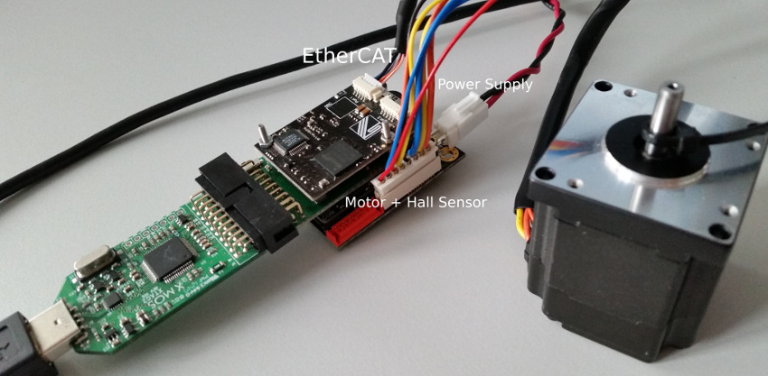

.. _app_demo_master_cyclic:

SOMANET EtherCAT Drive Cyclic Position/Velocity/Torque Control Demo
===================================================================

.. contents:: In this document
    :backlinks: none
    :depth: 3

This simple demonstration shows how to control your motor using **SOMANET EtherCAT DC-Drive** from a Linux PC. Only Cyclic Synchronous Position, Velocity and Torque control modes (CSP, CSV, CST) are included with a simple linear profile generator. The CSP, CSV and CST control modes are designed to achieve a desired motion trajectory by using various motion profiles and closing the control loop over EtherCAT. The slave controller is taking the generated position, velocity or torque setpoints at a fixed time interval (1ms) as a controller input and will be following them. 

.. cssclass:: github

  `See Application on Public Repository <https://github.com/synapticon/sc_sncn_ethercat_drive/tree/master/examples/app_demo_master_cyclic/>`_

Hardware setup
++++++++++++++

A minimal requirement for running this application is having the complete **SOMANET** stack assembled consisting of a **SOMANET Core-C22**, **SOMANET COM-EtherCAT** and a **SOMANET IFM-Drive** module. The stack should be powered via the **SOMANET IFM** board. An example of a stack consisting of the **SOMANET COM-EtherCAT**, **SOMANET Core-C22** and **SOMANET IFM-Drive-DC100** boards is shown below. In this case the **SOMANET IFM-Drive-DC100** board can be supplied with 12 - 24 V DC power source. Please refer to the corresponding IFM board hardware documentation and also motor specifications to select the proper supply voltage. For the best experience please make sure that your stabilized DC power supply is capable of delivering more than 2 Amperes of power for low power motors (up to 100W) and more than 10A for high power motors (up to 1kW). Please mind that at high motor accelerations starting current may be as high as 10 times the nominal.     

.. figure:: images/ethercat_stack.jpg
   :align: center

   Hardware Setup for SOMANET Cyclic Positioning Control with EtherCAT Demo

To setup the system:

   #. If you don't have the stack assembled, assemble it as shown in the image above. Make sure to connect the IFM side of the **SOMANET Core** module to the IFM-Drive board and COM side to the Core Debug Adapter (see markings on the Core module)
   #. Connect the xTAG Adapter to the Core Debug Adapter.
   #. Connect the xTAG to host PC. 
   #. Connect the motor supplied with the kit as shown in the image below.
   #. Connect the IFM-Drive board to a 24 V DC power supply.
   #. Connect one side of the Ethernet cable to the node and plug the RS-45 connector to your PC.
   #. Switch on the power supply. If everything is connected properly, drained current should not exceed 150mA. 

   Connecting the motor and cables to your kit

Build the application
++++++++++++++++++++++++++++++++

   #. You need the EtherCAT master :ref:`IgH EtherLab to be installed <ethercat_master_software_linux>` on your system to build the application.
   #. You need the :ref:`ncurses <https://www.gnu.org/software/ncurses/>` library installed on your system to build the application. There is probably a package existing for you linux distribution. It's the *libncurses-dev* package on Ubuntu:
   
   .. code-block:: bash
   
   $ sudo apt-get install libncurses5-dev

      
   #. The app also needs ``libreadsdoconfig`` which is in ``sc_sncn_ethercat_drive/examples/libreadsdoconfig``
   #. Navigate with the terminal to the application directory ``sc_sncn_ethercat_drive/examples/app_demo_master_cyclic`` an run ``make`` to build the app.

Run the application
+++++++++++++++++++

When the application has been compiled, the next step is to run it on the Linux PC. Before doing that, make sure that the SOMANET EtherCAT stack is running :ref:`a proper motor control software for the EtherCAT slave side <ethercat_slave_demo>`  

   #. Make sure your EtherCAT Master is up and running. To start the Master on a Linux machine, execute the following command: ::

      .. code-block:: bash
   
   $ sudo /etc/init.d/ethercat start

   #. Make sure your SOMANET node is accessible by the EtherCAT master by typing: ::

        .. code-block:: bash
   
   $ ethercat slave 

      The output should indicate a presence of the SOMANET node and pre-operational state if the slave side software is running: ::

        0  0:0  PREOP  +  CiA402 Drive

   #. Set all the parameters for you motor in the ``sc_sncn_ethercat_drive/examples/app_demo_master_cyclic/sdo_config/sdo_config.csv`` file
      This is a Comma Separated Values formatted file. The parameters are in the format: ::

       index, subindex,      axis 1,      axis 2,      axis 3,      axis 4,      axis 5,      axis 6

   #. Navigate with the terminal to the application directory on the hard disk. The compiled binaray is in the bin folder. Then execute the application. Use the ``-o`` flag if you want to enable ``sdo`` parameters upload from the ``sdo_config.csv`` file: ::

       bin/app_demo_master_cyclic -o

   #. The application will display the actual position, velocity and torque of each connected slaves. You can then switch to CSP, CSV or CST mode by pressing ``p``, ``v`` or ``t`` and set a target value by typing a number and press enter::

       -----------------------------------------------------------------------
       Slave  0: Torque control            0
                 Position            6406599 | Velocity       9 | Torque    18
       -----------------------------------------------------------------------

       > 100

   #. You can stop the selected slave with ``s`` (stop all the slaves with ``ss``). Quit the app with ``q``. And change the selected slave with the ``up`` and ``down`` keyboard arrows (the current selected slave is highlighted). If a slave in fault state you need to acknowledge the fault with ``a`` to reset it.
   

Commands
++++++++

The application provides the following command line arguments

  - ``-h``                          print this help and exit
  - ``-o``                          enable sdo upload
  - ``-v``                          print version and exit
  - ``-d``                          enable debug display
  - ``-s <speed>``                  profile velocity in rpm
  - ``-a <acceleration>``           profile acceleration in rpm/s
  - ``-t <torque acceleration>``    profile torque acceleration
                                    in 1/1000 of rated torque per second
  - ``-c <file>``                   SDO config filename

The application is a ``ncurses`` graphical console application. It uses simple commands to switch between CSP, CSV and CST modes and send a target position, velocity or torque:

  - ``up`` | ``down`` arrows: select slave
  - ``p`` | ``v`` | ``t``: switch to CSP | CSV | CST operation mode
  - ``[number]``: set target (depends on the opmode)
  - ``r``: reverse target
  - ``s``: disable operation, 'ss' to stop all the slaves
  - ``d``: enable debug display
  - ``m``: enable manual mode
  - ``c[dec number] | o[dec number]``: manually set the controlword | opmode
  - ``a``: acknowledge fault
  - ``q``: quit

The commands are also printed is the app.

Examine the code
++++++++++++++++

  Initialization:
    - The master is initialized with ``ecw_master_init``.
    - Then we read the number of slaves with ``ecw_master_slave_count``. Is is used later to loop through all the slaves.
    - If enabled we uploads the sdo parameters with ``write_sdo_config`` using the parameter parsed from the ``sdo_config.csv`` file.
    - The master is started with ``ecw_master_start``
    - The rest is initialisation of various data structures used by the app. The profiler settings are initialized using values from the command line arguments.

  Main loop:
    To be able to handle multiple slave all the functions of the main loop are executed for each slaves using a for loop with the slave count parameter. So each slave is handled independently. Only the commands entered by the user apply to only the selected slave. The selected slave is known by using the `select` local variable which is changed using the up and down arrows.

    - In the main loop the communication with the slave is done with ``ecw_master_cyclic_function``.
    - The pdo values are read and write with ``pdo_handler``.
    - The ``display_slaves`` function display the slaves data (position, velocity, torque) and state.
    - ``cs_command`` is managing the console commands. It will change the opmode, the selected slave and initialize the profiler when a new target is entered.
    - ``state_machine_control`` is an important function. It manages the slave state machine to switch to the opmode selected by the user. It basically puts the slave in ``SWITCH_ON_DISABLED`` state when switching the opmode and in ``OP_ENABLED`` state to enable the operation after the opmode is set.
    - ``target_generate`` generates a new position, velocity or torque target for each loop using the profiler.

