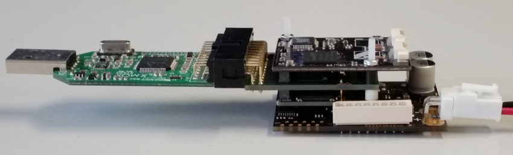

.. _app_demo_master_ethercat_tuning:

SOMANET EtherCat Drive Special Tuning Mode Application
======================================================

.. contents:: In this document
    :backlinks: none
    :depth: 3

This application is demonstrating the use of the tuning mode of SOMANET EtherCat Drive.
It allows finding the commutation offset of the motor, tuning of the PID parameters and test the Position, Velocity and Torque controllers. 
The application is given the functionnality to compensate :ref:`the cogging torque <Cogging-Torque-Feature>` of the motor, allowing a better control at low speed.

Hardware setup
++++++++++++++

A minimal requirement for this application to run is having the complete *SOMANET* stack assembled consisting of a *SOMANET Core-C2X*, *SOMANET COM-EtherCAT*, and a *SOMANET Drive* modules. The stack should be powered via the *SOMANET Drive* board. An example of a stack consisting of the *SOMANET* COM-EtherCAT, Core, and Drive 100 boards is shown below. In this case the *Drive 100* board can be supplied with 12 - 24 V DC power source. Please refer to the corresponding to your Drive board hardware documentation and also motor specifications to select the proper supply voltage. For the best experience please make sure that your stabilized DC power supply is capable of delivering more that 2 Amperes of power for low power motors (up to 100W) and more than 10A for high power motors (up to 1kW). Please mind that at high motor accelerations starting current may be as high as 10 times the nominal.     

   Hardware Setup for SOMANET Cyclic Positioning Control with EtherCAT Demo

To setup the system:

   #. If you don't have the stack assembled, assemble it as shown in the image above. Make sure to connect the IF2 side of the *SOMANET Core* module to the Drive 100 board and COM side to the Core Debug Adapter (see markings on the Core module)
   #. Connect the xTAG Adapter to the Core Debug Adapter.
   #. Connect the xTAG to host PC. 
   #. Connect the motor supplied with the kit as shown in the image bellow.
   #. Connect the *Drive* board to a 24 V DC power supply
   #. Connect one side of the Ethernet cable to the node and plug the RS-45 connector to your PC.
   #. Switch on the power supply. If everything is connected properly, drained current should not exceed 150mA. 

.. figure:: images/stack_and_motor.jpg
   :align: center

   Connecting the motor and cables to your kit

Build the application
++++++++++++++++++++++++++++++++

   #. You need the EtherCAT master :ref:`IgH EtherLab to be installed <ethercat_master_software_linux>` on your system to build the application.
   #. You need the `ncurses <https://www.gnu.org/software/ncurses/>`_ library installed on your system to build the application. There is probably a package existing for you linux distribution. It's the `°libncurses-dev°` package on Ubuntu.
   #. The app also needs ``libreadsdoconfig`` which is in ``sc_sncn_ethercat_drive/examples/libreadsdoconfig``
   #. Navigate with the terminal to the application directory ``sc_sncn_ethercat_drive/examples/app_demo_master_ethercat_tuning`` an run ``make`` to build the app.

Commands
++++++++

The application provides the following command line arguments

  - ``-h``             print this help and exit
  - ``-v``             print version and exit
  - ``-o``             enable sdo upload
  - ``-n <slave number>`` starting from 0. default is slave 0.
  - ``-s <profile velocity>`` velocity in rpm used for position profiler
  - ``-c <SDO config filename>`` filename of the sdo config csv file. Default is ``sdo_config/sdo_config.csv``
  - ``-F <record filename>`` filename where to record the position/velocity/torque in csv format. 

The application is a ``ncurses`` graphical console application. It uses simple text commands to control execute some actions or set parameters.
The commands consist of 1,2 or 3 characters with an optional number. The commands are case sensitive.

The following one character commands are executed directly without pressing enter after:

  - ``q``: stop the node and quit the app
  - ``[enter]``: just pressing enter will disable the torque controller block the brake.
  - ``0``: pressing 0 will switch to torque control mode with a 0 torque command. Which stops the motor slower than by disabling the torque controller with ``[enter]``. Be careful if the axis is loaded it could fall.
  - ``r``: reverse the current torque/velocity command
  - ``,``: start/stop record. this record the position/velocity/torque to a csv formated file.
  - ``[backspace]``: discard current command

The rest of the commands can be up to 3 characters with an optional number. The command is then executed by pressing [enter].
The number can be negative or decimal (for example ``1.2``). Spaces are ignored. The default number value is 0.

  - ``a``: start the auto offset tuning. It automatically update the offset field display. If the offset detection fails it will print ``WRONG SENSOR POLARITY!``.

   Some possible causes of failure of the offset detection are:
     - The sensor polarity is wrong. This can be fixed by changing the sensor polarity with the ``s`` command.
     - The torque applied during tuning is too low. This setting is set in the SDO config file. 20% should be enough for an open motor but a motor with gears or a load can need more.
     - The motor is blocked. If the motor does not freely turn during the detection the offset will be wrong.
     - The sensor is disconnected or not working properly. If the angle feedback is not working the offset will be wrong (but the motor will probably still turn during the tuning). Check the position feedback and the eventual sensor errors.
     - The motor phases are not connected properly. This will maybe prevent the motor to turn correctly and give a wrong offset.
     - The pole pairs setting is wrong. The motor will probably still turn during the tuning but the offset will be wrong.

   After the offset is found you need to make sure that a positive torque command result in a positive velocity/position increment (by testing). Otherwise the position and velocity controller will not work. If this is not the case use the ``m`` command to change the phase inverted parameter.

  - ``ac``:  start the cogging torque detection. It automatically records the cogging torque present in the motor in one mechanical rotation. After the torque is recorded, press “ec1” to enable the compensation of the cogging torque
  - ``acs``:  save the cogging torque recorded in the flash memory in a binary file called 'cogging_torque.bin'
  - ``acl``:  load the cogging torque previously stored in the flash memory
  - ``ap2``: start the automatic tuning of cascaded position controller. while cascaded position controller is being tuned, the dynamic values of PID controllers are shown on the terminal.
  - ``ap3``: start the automatic tuning of limited-torque position controller. During the automatic tuning procedure, the dynamic change of PID constants are updated on the terminal.
  - ``av``: start the automatic tuning of velocity controller. During the automatic tuning procedure, the dynamic change of PID constants are updated on the terminal.
  - ``b``: toggle the brake state between blocking and released.
  - ``bs``: set the brake release strategy parameter. 0 is to disable the brake. 1 to enable normal release. and 2 to 100 (percentage of maximum torque) for shaking release.
  - ``p[number]``: set a target position. the position control need to be enabled first.
  - ``pp[number]``: set a target position with profiler. The profile is executed on the master.
  - ``ps[number]``: start a position step command. For example ``ps1000`` will move to 1000 then to -1000 then to 0. The motor need to be in 0 position before sending this command.
  - ``psp[number]``: start a position step command with profile. same as ps but with profiler.
  - ``v[number]``: set a velocity command. the velocity controller needs to be enabled first.
  - ``ep[number]``: enable position control. The value is to set the position control mode. 1 is for simple PID, 2 for velocity cascaded, and 3 for limited torque position controller. The modes don't use the same parameters so check if the parameters are for the right mode before enabling.
  - ``ev1``: enable velocity control.
  - ``et1``: enable torque control.
  - ``ec``: toggle cogging torque compensation.
  - ``e``: and any command starting with e like ep, ev, et will disable the torque controller. It's the same as the command [enter].
  - ``z``: reset the multiturn position to 0 (the number of turn). This doesn't change the offset. This command only works with the REM 16MT position sensor.
  - ``zz``: reset the multiturn and singleturn position to 0. The offset need to be found again. This command only works with the REM 16MT position sensor.
  - ``o[number]``: set the commutation offset. The range is [0 - 4095].
  - ``s``: toggle the sensor polarity. It will make the sensor to return the position in reverse. You can try this if the offset detection keep failing.
  - ``d``: toggle the motion polarity. It reverse the position/velocity/torque commands and feedback in the motion controller. Which will make you motor turn the other direction.
  - ``m``: toggle the phase inverted parameter. Use this if after finding the offset you have a positive torque resulting in a negative velocity.
  - ``P[number]``: set the pole pairs. If when using torque control and the motor moves a little bit then "hold" a position it can be because the pole pairs are incorrect. (it can also be caused by the position sensor).
  - ``f``: reset the torque control fault. If the motor stops because of over/under current. Try adjusting you power supply settings and maybe set a lower maximum torque.
  - ``g[number]``: set the GPIO output. The number to input must be four ``0`` or ``1``. GPIO port 1 is the rightmost bit.
  - ``tss``: set the torque safe mode. in this mode all the phases are disconnected and the motor is free to move. Use this if you want to manually move the axis.
  - ``kpp [number]``: set the P coefficient of the Position controller.
  - ``kpi [number]``: set the I coefficient of the Position controller.
  - ``kpd [number]``: set the D coefficient of the Position controller.
  - ``kpl [number]``: set the Integral part limit the Position controller.
  - ``kpj [number]``: set the Moment of inertia of the Position controller.
  - ``kpP [number]``: set the Profiler mode the Position controller. 0 is disabled. 1 is enabled.
  - ``kvp [number]``: set the P coefficient of the Velocity controller.
  - ``kvi [number]``: set the I coefficient of the Velocity controller.
  - ``kvd [number]``: set the D coefficient of the Velocity controller.
  - ``kpl [number]``: set the Integral part limit the Velocity controller.
  - ``ktr [number]``: set the rated torque.
  - ``kf [number]``: set the cut-off frequency of the filter in motion control service in Hz (0 to disable)
  - ``Lp [number]``:  set both the maximum and minimum position limit to [number] and -[number]. The torque controller will be automatically disable when the position limit is reached. You can use this feature if your axis has a limited movement. If you are past the limits move the axis manually (use b and tss to unlock the motor) or restart position/velocity/torque controller in the right direction (the position limiter has a threshold to allow to restart if the motor is right after the limit).
  - ``Lpu [number]``: set the maximum position limit.
  - ``Lpl [number]``: set the minimum position limit.
  - ``Lt [number]``: set the torque limit. The unit in in 1/1000 of rated torque. This command stops the torque controller.
  - ``Lv [number]``: set the velocity limit. Used in velocity control and in cascaded and limited-torque position control modes.
  - ``[number]``: just entering a number will switch to torque control mode and set a target torque.

Some of the command descriptions are also printed is the app.

Run the application
+++++++++++++++++++

When the application has been compiled, the next step is to run it on the Linux PC. Before doing that, make sure that the SOMANET EtherCAT stack is running a proper motor control software for the EtherCAT slave side, i.e. ``app_demo_slave_ethercat_motorcontrol``.  

   #. Make sure your EtherCAT Master is up and running. To start the Master on a Linux machine, execute the following command: ::

       sudo /etc/init.d/ethercat start

   #. Make sure your SOMANET node is accessible by the EtherCAT master by typing: ::

        ethercat slave 

      The output should indicate a presence of the SOMANET node and pre-operational state if the slave side software is running: ::

        0  0:0  PREOP  +  CiA402 Drive

   #. Set all the parameters for you motor in the ``sc_sncn_ethercat_drive/examples/app_demo_master_ethercat_tuning/sdo_config/sdo_config.csv`` file
      This is a Comma Separated Values formatted files. The parameters are in the format: ::

       index, subindex,      axis 1,      axis 2,      axis 3,      axis 4,      axis 5,      axis 6

   #. Navigate with the terminal to the application directory on the hard disk. The compiled binaray is in the bin folder. Then execute the application. Use the ``-n`` parameter to select the node number. Use the ``-o`` flag if you want to enable ``sdo`` parameters upload from the ``sdo_config.csv`` file: ::

       bin/app_demo_master_ethercat_tuning -o -n 0

   #. The application will display the actual position, velocity and torque of the selected slave. It also displays some other parameters or status such as the commutation offset, the brake and motorcontrol status, the PID parameters, etc. If there is an error with the torque controller, motion control or position sensor it will be displayed on the last line::

        ** Operation mode: off **
        Position         122776 | Velocity               0
        Torque     22/    5 mNm | analog input 1:      289
        Offset             1200 | Pole pairs            10
        Motion polarity normal  | Sensor polarity normal
        Integrated Profiler off | Phases connection normal
        Brake blocking
        Speed  limit       5000 | Position min/max -2147483647 /  2147483647
        Torque rated    270 mNm | Torque max    100 /    27 mNm
        Position P     0.120000 | Velocity P      1.780000
        Position I     0.340000 | Velocity I      9.120000
        Position D     0.560000 | Velocity D      3.450000
        Position I lim     1000 | Velocity I lim       900
        Autotune Period    2000 | Amplitude          20000
        Filter                0 | GPIO input: xxxx / output: xxxx
        Cogging torque compensation OFF
        * Motor Fault Under Voltage *

        Commands:
        b:          Release/Block Brake
        a:          Find offset (also release the brake)
        number:     Set torque command
        r:          Reverse torque command
        ep3:        Enable position control
        p + number: Set position command
        P + number: Set pole pairs
        .:          Start/stop recording
        L s/t/p + number: set speed/torque/position limit
        ** single press Enter for emergency stop **

        >

   #. Use the commands previously described to find the commutation offset then tune and test the position/velocity/torque controllers. After you found the optimal parameters please note them (don't quit the app!) and update your ``sdo_config.csv`` file. You can also test the CSP,CSV,CST CiA 402 operation modes with the ``app_master_cyclic``.

   #. Once the controllers are tuned, you can test the cogging torque compensation. Use the command 'ac', the motor will start to calibrate, make two turns in each direction and stop. Once the compesator is calibrated, you can enable/disable it with the command ec. Note : to be able to calibrate, you need a good velocity tuning at 10 rpm. 
   
   #. Then you can save the cogging torque in the flash memory using the 'acs' command. When the node is powered off then on again, load it with the command 'acl'.
   
Examine the code
++++++++++++++++

  Initialization:
    - The master is initialized with ``ecw_master_init``.
    - If enabled we uploads the sdo parameters with ``write_sdo_config`` using the parameter parsed from the ``sdo_config.csv`` file.
    - The master is started with ``ecw_master_start``
    - The rest is initialisation of various data structures used by the app. The profiler settings are initialized using values from the command line arguments.

  Main loop:
    - In the main loop the communication with the slave is done with ``ecw_master_cyclic_function``.
    - The pdo values are read and write with ``pdo_handler``.
    - First the app will try to switch the slave to the `OPMODE_TUNING`. It use a simple function ``go_to_state`` to control the CiA402 state machine on the slave to change the opmode.
    - The ``tuning_input`` parse the received input pdo and unmux all the parameters and status sent by the slave.
    - All this is then displayed with the ``tuning_display`` function.
    - ``tuning_command`` is managing the console commands. It parses the text command and converts them to the corresponding numeric tuning commands.
    - ``tuning_position`` generates a new position target. It uses the profiler when the ``pp`` or ``psp`` commands are active.

