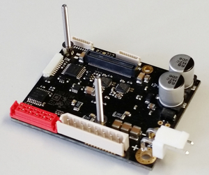
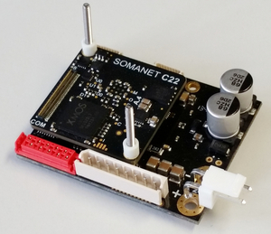
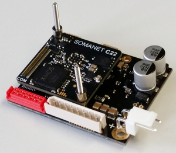
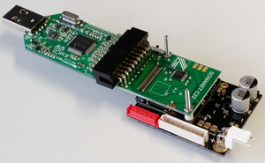

.. _XMOS_Motor_Motion_Control_Kit_User_Guide:

Getting Started with your XMOS Motor & Motion Control Kit
=========================================================

The XMOS Motor & Motion Control Kit contains a combination of hardware and software modules developed by Synapticon using *SOMANET* technology and XMOS multi-core micro-controllers, with a sample BLDC motor. The kit can be assembled in different configurations depending on the type of motor and communications interface you require. Currently there are two hardware configurations:

   * *SOMANET IFM-Drive-DC100* with EtherCAT comms and BLDC motor with Hall sensor encoding
   * *SOMANET IFM-Drive-DC100* with EtherCAT comms and BLDC motor with Quadrature encoder and Hall sensor encoding

For information on assembling the *SOMANET* hardware modules, see the Hardware Quick Start Guide.

For information on connecting the motor, see the Connecting Motor Guide.

The software modules available for the kit include:

   * Motor commutation with position, velocity & torque control loops
   * Support for Hall and Quadrature encoder sensors
   * EtherCAT communication[1]
   * CiA402 drive profile

[1] The Motor & Motion Control kits can be driven directly from the USB port using the xTAG-2 debug adapter; however to evaluate the EtherCAT module contained in the kit an EtherCAT master is required. An open source Linux-based IgH EtherCAT Master is available from EtherLab. Windows developers must purchase a TwinCAT license from Beckhoff Automation GmbH, or a similar solution. 

For information on running the software modules, see the Software Quick Start Guide.

.. _XMOS_Motor_Motion_Control_Kit_User_Guide_Hardware:

Hardware Quick Start Guide
----------------------------

This guide shows how to assemble the Motor & Motion Control Kit modules in the following configurations:

   * *SOMANET IFM-Drive-DC100* with *SOMANET COM-EtherCAT* module and xTAG debug adapter
   * *SOMANET IFM-Drive-DC100* with *SOMANET COM-EtherCAT* module and no debug adapter
   * *SOMANET IFM-Drive-DC100* without *SOMANET COM-EtherCAT* module

.. _XMOS_Motor_Motion_Control_Kit_User_Guide_Hardware_EtherCAT:

Setting up with COM-EtherCAT module
+++++++++++++++++++++++++++++++++++

This setup is required if you want to develop an EtherCAT based slave application for *SOMANET* devices. Before you start, make sure that you have all hardware components and assembly parts at hand. You will require the following items:

   #. 1 x *SOMANET IFM-Drive-DC100* board.
   #. 1 x *SOMANET Core-C22* module.
   #. 1 x *SOMANET COM-EtherCAT*
   #. 1 x Core to xTAG-2 Debug Adapter.
   #. 1 x XMOS xTAG-2 Adapter
   #. 2 x 25mm M2 screws
   #. 4 x 4mm metal spacers
   #. 2 x 3.5mm plastic spacers
   #. 2 x M2 nuts.

The image below illustrates the required set for this hardware setup.

.. figure:: images/HW_set_complete.jpg
   :width: 300px
   :align: center

   Required components and assembly parts

It is recommended to start assembly from the *SOMANET IFM-Drive-DC100* board. Place the long metal screws in two holes as shown in image below. Use 4 mm metal spaces between the IFM and the Core modules.

   Step 1

Then proceed with the *SOMANET Core-C22* module. Hold the screws with your fingers to prevent them from falling out during the assembly procedure. Make sure that you connect the IFM side connector of the Core module to the *SOMANET IFM-Drive-DC100* board. The IFM connector of the Core module has ``IF`` marking next to it. As a result you should see the ``COM`` connector being on top. For mounting the Core to xTAG-2 Adapter in the next step please use the white plastic 3.5 mm spacers. 

   Step 2

When mounting the Core to xTAG-2 Adapter, hold the IFM connector side with your thumb to prevent from unplugging. Also be careful with the golden pins of the Core to xTAG-2 Adapter not to bend them or to break. The golden pins should have a reliable contact at the end with the corresponding pads of the *SOMANET Core-C22* module.

.. figure:: images/assembly_p3.jpg
   :width: 300px
   :align: center

   Step 3

Use two metal 4 mm spacers for mounting the COM-EtherCAT board on top of the Core to xTAG-2 Adapter. 

.. figure:: images/assembly_p9.jpg
   :width: 300px
   :align: center

   Step 4

When mounting the COM-EtherCAT board, press the IFM connector side of the Core module with your thumb to prevent from unplugging. Press together the modules on the COM connector side and make sure that the all modules are properly plugged. Then fix the screws with the nuts.

.. figure:: images/assembly_p4.jpg
   :width: 300px
   :align: center

   Step 5

All you need now to start programming is to connect the XMOS xTAG-2 adapter as shown in image below. Note that the USB cable and a power supply are not included into the kit. 

.. figure:: images/assembly_p7.jpg
   :width: 300px
   :align: center

   Step 6

.. _XMOS_Motor_Motion_Control_Kit_User_Guide_Hardware_EtherCAT_No_xTAG:

Setting up with COM-EtherCAT module without Core to xTAG-2 Adapter
++++++++++++++++++++++++++++++++++++++++++++++++++++++++++++++++++

This setup is useful if software debugging or xSCOPE functionality is not required and you have previously flashed the *SOMANET* node with a firmware that includes update functionality via EtherCAT. 

You will require the following items:

   #. 1 x *SOMANET IFM-Drive-DC100* board.
   #. 1 x *SOMANET Core C22* module.
   #. 1 x *SOMANET COM-EtherCAT*
   #. 2 x 25mm M2 screws
   #. 4 x 4mm metal spacers
   #. 2 x M2 nuts.

The image below illustrates the required set for this hardware setup.

.. figure:: images/HW_set_complete_w_o_debug.jpg
   :width: 300px
   :align: center

   Required components and assembly parts

To assemble the stack for using with *SOMANET COM-EtherCAT* without the Core to XTAG2 Adapter please perform step 1 as described in **Setting up with COM-EtherCAT module** section. Then proceed with the *SOMANET Core-C22* module. Please hold the screws with your fingers to prevent them from falling out during the assembly procedure. Make sure that you connected the IFM side connector of the "Core-C22" module to the *SOMANET IFM-Drive-DC100* board. The IFM connector of the core module has ``IF`` marking next to it. As a result you should see the connector marked as``COM`` being on top. For mounting the COM-EtherCAT module in the next step please use the metal 4 mm spacers. 

   Step 2

When mounting the COM-EtherCAT board, hold the IFM connector side of the Core module with your thumb to prevent from unplugging. Press together the modules on the COM connector side and make sure that the all modules are properly plugged. Then fix the screws with the nuts.

.. figure:: images/assembly_p6.jpg
   :width: 300px
   :align: center

   Step 3

All you need now to start programming the *SOMANET* stack is to connect the Ethernet cable from the kit to one of the ports of the COM-EtherCAT module and to an Ethernet port of your PC. Note that the power supply is not included into the kit. 

.. _XMOS_Motor_Motion_Control_Kit_User_Guide_Hardware_No_EtherCAT:

Setting up without COM-EtherCAT module
++++++++++++++++++++++++++++++++++++++

This is a minimal hardware setup to start working with the motor control software. Before you start, make sure that you have all hardware components and assembly parts at hand. You will require the following items:

   #. 1 x *SOMANET IFM-Drive-DC100* board.
   #. 1 x *SOMANET Core-C22* module.
   #. 1 x Core to xTAG-2 Debug Adapter.
   #. 1 x XMOS xTAG-2 Adapter
   #. 2 x 25mm M2 screws
   #. 2 x 4mm metal spacers
   #. 2 x 3.5mm plastic spacers
   #. 2 x M2 nuts.

The image below illustrates the required set for this hardware setup.

.. figure:: images/HW_set_minimal.jpg
   :width: 300px
   :align: center

   Required components and assembly parts

It is recommended to start assembly from the *SOMANET IFM-Drive-DC100* board. Please place the long metal screws in two holes as shown in image below. Use 4 mm metal spaces between the IFM and the Core modules.

   Step 1

Then proceed with the *SOMANET Core-C22* module. Please hold the screws with your fingers to prevent them from falling out during the assembly procedure. Make sure that you connected the IFM side connector of the Core module to the IFM-Drive-DC100 board. The IFM connector of the Core module has ``IF`` marking next to it. As a result you should see the ``COM`` connector being on top. For mounting the Core to xTAG-2 Adapter in the next step please use the white plastic 3.5 mm spacers. 

   Step 2

When mounting the Core to xTAG-2 Adapter please fixate the IFM connector side with your thumb to prevent from unplugging. Also be careful with the golden pins of the Core to xTAG-2 Adapter not to bend them or to break. The golden pins should have a reliable contact at the end with the corresponding pads of the *SOMANET Core-C22* module. When successfully mounted, please fixate the stack with the metal nuts. The stack is ready to use.

.. figure:: images/assembly_p3.jpg
   :width: 300px
   :align: center

   Step 3

All you need now to start programming is to connect the XMOS xTAG-2 adapter as shown in image below. Note that the USB cable and a power supply are not included into the kit. 

   Step 4

.. _XMOS_Motor_Motion_Control_Kit_User_Guide_Motor:

Connecting the Motor Guide
---------------------------

The kit includes a sample motor that you can use the software modules to run. The motor is available with Hall Sensor only option, or Quadrature Encoding and Hall sensors.

Power is supplied to all the boards in the kit by an 8-24V DC power supply, connected to the power connection on the IFM DC100 board. 

Connect the motor
+++++++++++++++++++++

   #. Plug the power connector from the motor into the white Motor and Hall Sensor 8-pin SPOX connector on the IFM DC100 board.

   #. **QEI motors only**: Plug the Quadrature Encoding connector to the red 10-pin Encoder connector on the IFM DC100 board.

   #. Connect the xTAG-2 debug adapter to the xSYS connector on the xTAG Adapter. Connect the xTAG-2 to your development system.

   #. Slide the switch on the xTAG Adapter away from the xTAG-2. An LED lights up to indicate that the JTAG connection is active.

   #. Plug the power cable from a standalone power supply into the power connector on the IFM CD100 board.

Your motor is now ready for testing.

.. _XMOS_Motor_Motion_Control_Kit_User_Guide_Software:

Software Quick Start Guide
--------------------------

The Motor & Motion Control Kit includes a set of software modules that run on the hardware, including:

   * Core control module with up to 2000 MIPS compute
   * Current, speed and position control loops, closed on slave or master side
   * CiA 402 drive profile
   * Communications - EtherCAT (Linux master provided)
   
The software is delivered as individual components within the *xTIMEcomposer* Studio development tools, which are available free of charge from the XMOS website: http://www.xmos.com/xtimecomposer

Installing *xTIMEcomposer*
++++++++++++++++++++++++++

The *xTIMEcomposer* tool chain is a suite of development tools for xCORE multi-core micro-controllers. It provides everything you need to develop applications to run on the hardware, as well as unique tools for timing closure and code instrumentation. The tools can be run from *xTIMEcomposer* Studio, an integrated development environment based on Eclipse, or the command line. XMOS provides a free to download version of *xTIMEcomposer* to all users who register on the XMOS website. The tools can be downloaded from: http://www.xmos.com/xtimecomposer

Detailed information on how to use *xTIMEcomposer* is available in the *xTIMEcomposer* User Guide (http://www.xmos.com/published/xtimecomposer-user-guide). The *xTIMEcomposer* Studio Welcome screen also contains many useful links.

Information and examples on how to program xCORE multi-core micro-controllers is available in the XMOS programming guide (http://www.xmos.com/published/xmos-programming-guide).

**NOTE**: The first time you run *xTIMEcomposer* Studio you must be connected to the Internet, so that you can register your version of the tools.

Importing and running the Profile application
+++++++++++++++++++++++++++++++++++++++++++++

The *SOMANET* software includes a Profile application that provides the ideal starting application. It uses data from the Hall sensors to test that your motor is working correctly.

The *SOMANET* software is delivered as *xSOFTip* components in *xTIMEcomposer* Studio. You can add them to your project using the *xSOFTip* Explorer, an integrated tool in *xTIMEcomposer* Studio.

   #. Open *xTIMEcomposer* Studio.

   #. Go to the *xSOFTip* Explorer in the bottom right corner of the *xTIMEcomposer* Studio window.

   #. Open the Synapticon > *SOMANET* folder, which contains all the software that will run on the kit.

   #. Click on the ``SOMANET Profile Mode Position Control Application`` item in the *xSOFTip* Explorer. Detailed information about the module is displayed in the Developer Column on the right of the window.

   #. Double-click the ``SOMANET Profile Mode Position Control Application`` in *xSOFTip* Explorer. *xTIMEcomposer* prompts you to import the module. Note that the *SOMANET* software is licensed under different terms to the usual XMOS *xSOFTip* license.

   #. Click Finish. *xTIMEcomposer* imports the software including all its dependencies, and the software is added to a new project.

   #. Select the ``app_demo_bldc_position`` item in the Project Explorer, and then click Project > Build Project (Hammer) button to build the project.  The build progress is displayed in the *xTIMEcomposer* Console. When the application has been built, the compiled binary is added to the app_sncn_motorctrl_profile/bin folder.

   #. Click Run > Run Configurations, and double-click xCORE Application.

   #. On Project, click on Browse and select ``app_demo_bldc_position``. 

   #. Click on Refresh on Debug Adapter. "XMOS xTAG 2 connected to L1[0..3] should appear" indicating that there is communication between the JTAG adapter and the C22 module. If JTAG is not recognized by *xTIMEcomposer* Studio, check if the JTAG drivers of the JTAG. Download the driver from here. If JTAG is recognized but "L1[0..3]" does not appear, check the connections and see if the Motor & Motion Control Kit is powered up.

   #. Click Run. 

After few second the motor should begin to execute its position seeking algorithm. The position feedback from the kit will be printed on the console. Attempting to gently turn the spindle of the motor should provoke a reaction from the controller as it holds its position.

Importing the EtherCAT application
+++++++++++++++++++++++++++++++++++

**Installing the EtherCAT Master Software**

If you have not done so already you need to install the IgH EtherCAT Master for Linux.

   #. Download the EtherCAT master software and associated makefiles from `<http://doc.synapticon.com/index.php/File:IgHEthercatLinuxMaster.zip>`_. Do not try and get the software from the EtherLab site.
   #. Unpack the file and navigate into the folder
   #. Be sure to have Linux kernel headers and build-essential installed in order to avoid compilation errors. They can be installed following this command:

      ::

         sudo apt-get install linux-headers-$(uname -r) build-essential

   #. Compile the master driver::

         make ethercatMaster

   #. After compiling, install the driver. You also have the possibility to install it setting an auto-start when booting configuration::

         make ethercatMasterInstall

   #. Remove the installation files at the directory then do::

         make clean

   #. Connect the *SOMANET COM-EtherCAT* module to your computer using the EtherCAT cable provided in the kit.
   #. Open a terminal and enter the following command to run the EtherCAT driver::

         sudo /etc/init.d/ethercat start

   #. Type the following command to verify the connected slaves::

         ethercat slave

   #. The *SOMANET* slave node should now be recognised and displayed in the terminal.
   #. to stop your EtherCAT Master driver just run::
         sudo /etc/init.d/ethercat stop

**Preparing the EtherCAT Master Demo application**

   #. Open the Synapticon > SOMANET folder and bring the ``EtherCAT CSP Motor Control Demo`` item in the *xSOFTip* Explorer into your Project Explorer by dragging it or double clicking it.
   #. Now do the same thing for the following items::

      * Synapticon -> SOMANET ->  SOMANET CiA 402 Definitions for Control Protocol
      * Synapticon -> SOMANET ->  SOMANET Protocol Library for Motor Control
      * Synapticon -> SOMANET ->  SOMANET Motor Drive Library
      * Synapticon -> SOMANET ->  SOMANET Motor and Controller Configuration Files

   #. Now place your *xTIMEcomposer* into the background and in a separate terminal and navigate into your workspace folder.
   #. cd into ``lib_linux_ctrlproto`` and type ``make`` to build that library
   #. cd into ``lib_linux_motor_drive`` and type ``make`` to build that library
   #. cd back into your workspace and then cd to ``app_demo_master_cyclic_position/bin`` and type the following command to run the master example::

         sudo ./app_demo_master_cyclic_position

**Slave application side**

   #. Open the Synapticon > SOMANET folder and click on the ``SOMANET etherCAT Slave Application`` item in the *xSOFTip* Explorer. Detailed information about the module is displayed in the Developer Column on the right of the window.
   #. Double-click the ``SOMANET EtherCAT Slave Application`` in *xSOFTip* Explorer. *xTIMEcomposer* prompts you to import the module. 
   #. Click Finish. *xTIMEcomposer* imports the software including all its dependencies, and the software is added to a new project.
   #. Select the ``app_demo_slave_ethercat_motorcontrol`` item in the Project Explorer, and then click Project > Build Project (Hammer) button to build the project.  The build progress is displayed in the *xTIMEcomposer* Console. When the application has been built, the compiled binary is added to the app_sncn_motorctrl_profile/bin folder.
   #. Click Run > Run Configurations, and double-click xCORE Application.
   #. In *xTIMEcomposer* Studio go to Run>Run Configurations.
   #. Double click on xCORE Application.
   #. Select sw_sncn_motorcontrol_ethercat_kit under Projects
   #. Check that the C/C++ Application is ``app_demo_slave_ethercat_motorcontrol.xe``
   #. Click on Run 

**Output**

Check the terminal. The master application sends values to the node and then the nodes sends them back, which are displayed in the terminal. After the controller executes the desired motion profile the master application will disable the motor and exit.

.. _XMOS_Motor_Motion_Control_Kit_User_Guide_Next:

